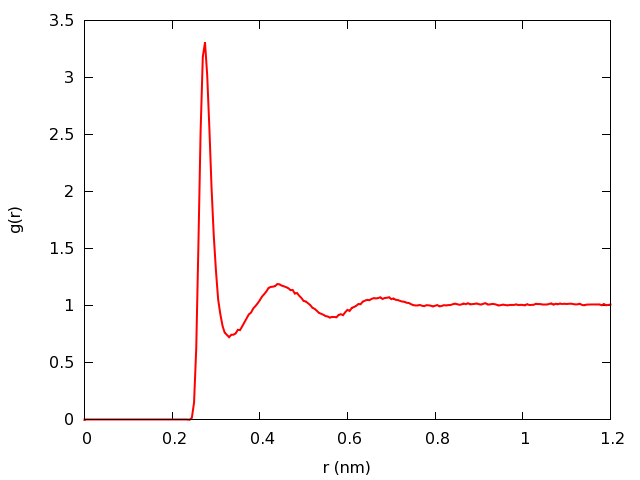

##About 

This is a simple radial distribution function (RDF) calculation for use with GROMACS output.
GROMACS already includes a utility for calculating an RDF, so this is probably
just useful as an example. It uses libgmxcpp which reads in all frames at the
beginning so the calculation can be run in parallel.

##Requirements

[libgmxcpp](https://github.com/wesbarnett/libgmxcpp/releases) is required.

##Compiling

````bash
git clone git@github.com:wesbarnett/rdf.git
cd rdf
make
````

##Running

To run, do the following:

````bash
./rdf conf.in
````

An example configuration file is found in the repository. It should have the
following, in this order:

* Name of xtc file to read in
* Name of index file to read in
* Name of output file
* Name of first group in rdf calculation
* Name of second group in rdf calculation (can be the same as the first)
* Exclusion distance (so that atoms on the same molecule won't be counted)
* Bin width
* Location of last bin

Again, see the example in conf.in.

##Example

Just for fun, here is an example of a water-water (OW-OW) RDF for TIP4PEW using output
from this program:


